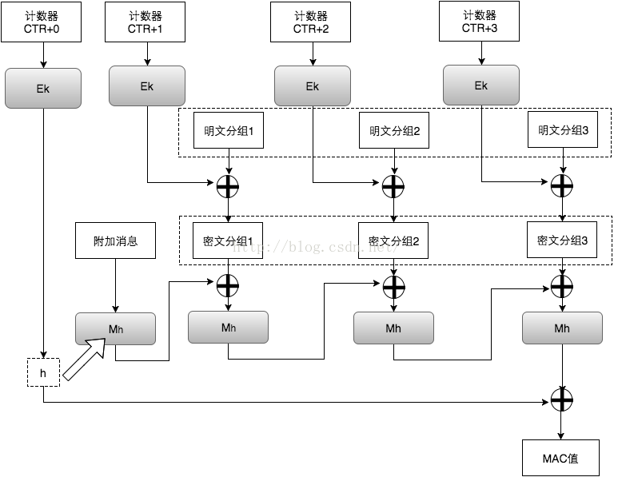
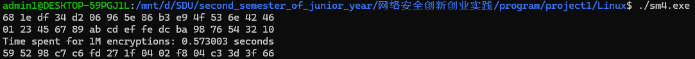
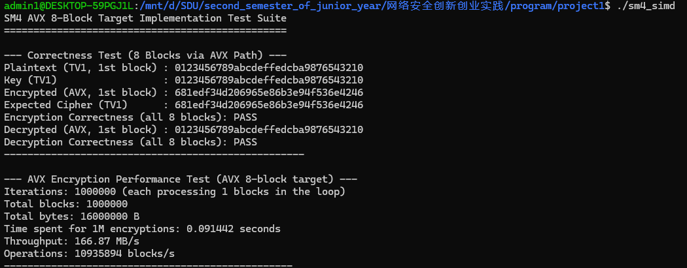
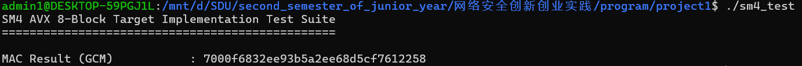

# 实验报告

## 一、实验目的
- 掌握国密 SM4 对称分组密码算法的工作原理与实现方法。  
- 理解 SM4 算法中的轮函数、线性变换与 S‑box 查表的具体实现。  
- 在源码层面分析并总结本实现所采用的各种优化手段。

## 二、算法原理

### 1. SM4 概述
SM4 是中国国家密码管理局发布的对称分组密码标准，分组长度 128 bit，密钥长度 128 bit，采用 32 轮非对称 Feistel 结构。每轮主要包含以下操作：  
1. **轮密钥加**：将当前轮的子密钥与状态字进行异或。  
2. **非线性变换 S‑box**：对 32 bit 输入分为 4 个字节，分别通过 8×8 S‑box 查表得到输出。  
3. **线性变换 L**：对 S‑box 输出做循环左移并异或，产生新的 32 bit 状态字。  
4. **状态更新**：将新状态与前四次状态按特定次序组合，继续进入下一轮。

### 2. 主要函数流程
***未优化sm4***
- **sm4_setkey** / **sm4_setkey_enc** / **sm4_setkey_dec**：  
  - 从 128 bit 主密钥派生 32 个 32 bit 轮密钥（子密钥），包含取大端、异或系统常量 FK、经 S‑box + 线性变换 L′ 后与 CK 异或等步骤。  
  - 加密和解密的子密钥序列顺序相反，以支持反向运算。
- **sm4_one_round**：  
  - 将 128 bit 明文切分为四个 32 bit 状态字，依次调用 **sm4F**（结合 S‑box + 线性变换 sm4Lt）与轮密钥，迭代 32 轮，最后输出逆序拼接的四个状态字作为一轮加密结果。
- **sm4_crypt_ecb** / **sm4_crypt_cbc**：  
  - ECB 模式：每 16 Bytes 独立加密；  
  - CBC 模式：加密时先与 IV 异或再加密，并更新 IV；解密时先解密再与 IV 异或。

***avx2优化sm4***
- **资源初始化** (`init_sm4_resources`)
   - 构造并缓存四张 256×32 位的查表 (T0~T3)，方便标量与向量化轮函数中快速查表。
   - 构造 AVX2 用于字节转换与掩码的 `BYTE_SWAP_32BIT_MASK`、`MASK_0x1F` 等常量。

- **密钥扩展** (`sm4_key_schedule_internal`)
   - 将 128 位主密钥加载并转换端序，异或固定 FK 常量。
   - 循环 32 轮，通过 `tau_scalar`(S-box + 32 位打包) 与 `L_key_scalar` 实现非线性与线性变换，生成 32 个轮密钥。

- **并行加密 8 块** (`sm4_crypt_8blocks_internal`)
   - 使用宏 `TRANSPOSE_LOAD_8BLOCKS_TO_SIMD` 将连续 8×16 字节数据块转换为 4 条 `__m256i` 向量寄存器对齐的状态。
   - 每轮通过 `SM4_ROUND_GATHER` 宏：
     - 并行计算轮函数输入 T = X1 ^ X2 ^ X3 ^ rk。
     - 利用 `_mm256_i32gather_epi32` 从预生成的 T0~T3 表中向量化查表。
     - 聚合四次查表结果并行计算线性变换输出。
     - 更新 X0~X3 四条寄存器。
   - 循环 32 轮后，用 `TRANSPOSE_STORE_SIMD_TO_8BLOCKS` 转置并还原到字节序写回输出缓冲。

- **尾块标量处理**
   - 当剩余块数不足 8 时，落回到逐块拷贝输入，按主机端序解包，用标量查表 (T0~T3) 实现轮函数，最后打包回大端序输出。

### 3.详细数学过程：

***sm4加密部分***

*每轮更新公式：*

$$
T = X_{r+1} \oplus X_{r+2} \oplus X_{r+3} \oplus rk_r,  \quad
X_{r+4} = X_r \oplus T_{\mathrm{enc}}(T), \quad r=0,1,\dots,31.
$$

最终输出顺序为 $(X_{35},X_{34},X_{33},X_{32})$。

#### 1.1 S‑box 及 $\tau$ 变换
输入 32 位字 $T$ 拆分为四个字节 $T = (b_3\|b_2\|b_1\|b_0)$，应用非线性替代：

$$
\tau(T) = \bigl(S(b_3)\ll24\bigr)\oplus \bigl(S(b_2)\ll16\bigr)\oplus \bigl(S(b_1)\ll8\bigr)\bigr)\oplus S(b_0),
$$

其中 $S(\cdot)$ 是固定的 8×8 位替代表。

#### 1.2 线性变换 $L_{\mathrm{enc}}$
对 $\tau(T)$ 结果 $u$，定义：

$$
L_{\mathrm{enc}}(u) = u \oplus (u \lll 2) \oplus (u \lll 10) \oplus (u \lll 18) \oplus (u \lll 24),
$$

其中 $\lll n$ 表示 32 位循环左移 $n$ 位。故：

$$
T_{\mathrm{enc}}(T) \,=\, L_{\mathrm{enc}}\bigl(\tau(T)\bigr).
$$

#### 1.3 密钥扩展 $T_{\mathrm{key}}$
设主密钥 $MK = (MK_0,MK_1,MK_2,MK_3)$，常量 $FK=[FK_0,FK_1,FK_2,FK_3]$ 及轮常量 $CK_i$，初始化：

$$K_i=MK_i\oplus FK_i,\quad i=0..3.$$

第 $i$ 个轮密钥：

$$T' = K_{i+1}\oplus K_{i+2}\oplus K_{i+3}\oplus CK_i, \quad rk_i = K_i \oplus T_{\mathrm{key}}(T'),$$

$$T_{\mathrm{key}}(x) = x \oplus (x \lll 13) \oplus (x \lll 23).$$

共生成 $rk_0,\dots,rk_{31}$。

***gcm模式部分***

总体流程图如下：



算法细节如下：

#### Galois/Counter Mode (GCM) 原理与结构

GCM（Galois/Counter Mode）是一种同时提供**机密性**和**完整性**保护的分组密码工作模式，广泛应用于高速网络协议（如 TLS、IPsec）。其核心可分为两部分：

1. **计数器模式（CTR）**：用于加密明文，获得密文。
2. **GHASH 验证**：基于有限域乘法的认证标签生成，确保数据及附加数据（AAD）的完整性。

#### CTR 加密部分

* 选择一个初始向量 IV（通常 96 位），并构造初始计数器块：

  $$
  \text{Counter}_0 = \underbrace{\text{IV}}_{96\,\mathrm{bit}} \,\|\, \mathrm{0x00000001}
  $$

* 对第 $i$ 个计数器块进行加密，得到密钥流块 $S_i$：

  $$
  S_i = E_K(\text{Counter}_i)
  $$

* 明文分组 $P_i$ 与 $S_i$ 异或生成密文分组 $C_i$：

  $$
  C_i = P_i \oplus S_i
  $$

* 计数器递增：

  $$
  \text{Counter}_{i+1} = \text{Counter}_i + 1 \quad (\bmod\,2^{32}\text{ on the last 32 bits})
  $$

#### GHASH 认证部分

GHASH 在 GF($2^{128}$) 上定义，通过多项式乘法实现对数据的认证。步骤如下：

1. **密钥生成**
   使用零输入块生成哈希子键 $H$：

   $$
   H = E_K(0^{128})
   $$

2. **数据分组**

   * 附加数据（AAD）分组：$A_1, A_2, \dots, A_u$，每组 128 位，最后一组可填充零。
   * 密文分组：$C_1, C_2, \dots, C_v$，同样 128 位对齐。

3. **GHASH 计算**
   定义常用符号：对两个 128 位向量 $X,Y$，其乘法定义为 GF($2^{128}$) 多项式乘法再模化简。

   首先，将 AAD 和密文拼接，并在尾部附加两者的比特长度：

   $$
   S = (A_1 \,\|\, A_2 \,\|\, \dots \,\|\, A_u \,\|\, C_1 \,\|\, \dots \,\|\, C_v \,\|\, \mathrm{len}(A)\,\|\,\mathrm{len}(C))
   $$

   然后，按块迭代计算：

   $$
   X_0 = 0^{128},\quad  
   X_i = \bigl(X_{i-1} \oplus S_i\bigr)\,\otimes\,H,\quad i=1,\dots,m
   $$

   其中 $m = u+v+1$，最后 $X_m$ 即为 GHASH 输出。

4. **生成认证标签**
   使用 CTR 加密对第零块输出加密，并与 GHASH 结果异或：

   $$
   T = E_K(\text{Counter}_0) \oplus X_m
   $$

   最终输出 $(C_1,\dots,C_v,\,T)$，解密端按同样步骤重算并对比 $T$ 以验证完整性。

#### 安全性与性能

* **并行性**：
  CTR 部分所有 $E_K(\text{Counter}_i)$ 均可并行计算；GHASH 乘法同样可用表查或 SIMD 加速。
* **认证强度**：
  标签长度通常取 128、120、112、…、32 位，可在安全需求与带宽之间权衡。
* **常见实现要点**：

  * **IV 长度**：若非 96 位，需先 GHASH 处理成 128 位有效 IV；
  * **补齐与尾部长度域**：确保 AAD 与明文紧凑对齐；
  * **防重放**：同一 IV 绝不可重复使用，否则可能破坏安全性。


## 三、本代码的优化方案
***未优化sm4***
1. **宏定义简化高性能位运算**  
   - 使用 `GET_ULONG_BE` / `PUT_ULONG_BE` 宏实现大端字节序与 32 bit 整数相互转换，将循环与位移合并，减少函数调用开销。  
   - `SHL`、`ROTL` 宏一次完成 32 bit 循环左移，避免多步位移和掩码操作。

2. **S‑box 查表与线性变换合并**  
   - 在 `sm4Lt` 与 `sm4CalciRK` 中，先将输入打散为 4 字节通过 `sm4Sbox` 查表，再一次性用 `GET_ULONG_BE` 还原并进行多次循环移位与异或，将非线性和线性变换合并，提高缓存命中率。

3. **内联小函数避免额外调用开销**  
   - 将 `sm4Sbox`、`sm4Lt`、`sm4F`、`sm4CalciRK` 等声明为 `static inline`（或按宏展开），减少函数栈开销与跳转延迟。

4. **循环展开与本地变量重用**  
   - 在 `sm4_one_round` 中，将状态字数组 `ulbuf` 预先申请一次，循环内部只更新必要位置，避免动态分配或频繁 memset。

5. **模式复用**  
   - ECB 与 CBC 模式的核心都调用同一轮函数 `sm4_one_round`，减少重复代码，便于编译器优化。

***avx2优化sm4***
1. **向量化并行**
   - 利用 AVX2 256 位寄存器并行处理 8 个 128 位数据块，将 8×32 位状态分量映射到四条 `__m256i` 寄存器，实现批量加密。

2. **查表融合**
   - 预先用标量完成 S-box + 线性变换 (L_enc) 并填充四张 256×32 位查表 (T0~T3)，向量化轮函数只需一次 gather + XOR 即可获得完整轮函数输出。（T-table优化）

3. **高效转置**
   - 通过 `_mm256_unpack`、`_mm256_shuffle_epi8` 等指令，将内存连续块与 SIMD 寄存器行列转置相结合，实现字节顺序与数据布局对齐。

4. **端序无分支**
   - 统一用 AVX2 掩码与 `BYTE_SWAP_32BIT_MASK` 做字节交换，相比多分支的大端/小端处理更高效。

5. **混合调度**
   - 针对剩余不足 8 块的数据采用标量查表路径，避免对少量数据无谓的向量化开销。

---

# README

## 一、简介
本项目提供国密 SM4 对称分组密码的纯 C 语言实现，支持 ECB 与 CBC 两种加解密模式，适用于嵌入式与高性能场景。

## 二、环境依赖
***未优化sm4***

- C99 标准兼容编译器（如 `gcc`, `clang`）
- 无额外第三方库依赖

***avx2优化sm4***

- 支持 AVX2 的 x86-64 架构 CPU
- GCC/Clang 等支持 `-mavx2` 的 C11 编译器

## 三、接口说明

***未优化sm4代码：***
```c
// SM4 上下文结构
typedef struct {
    int      mode;   // SM4_ENCRYPT 或 SM4_DECRYPT
    unsigned long sk[32];  // 32 轮子密钥
} sm4_context;

// 轮密钥生成（加密用）
void sm4_setkey_enc( sm4_context *ctx, unsigned char key[16] );
// 轮密钥生成（解密用）
void sm4_setkey_dec( sm4_context *ctx, unsigned char key[16] );

// ECB 模式加/解密
// mode: SM4_ENCRYPT 或 SM4_DECRYPT
// length: 字节数，必须是 16 的整数倍
void sm4_crypt_ecb( sm4_context *ctx,
                    int mode,
                    int length,
                    unsigned char *input,
                    unsigned char *output );

// CBC 模式加/解密
// iv: 初始向量，16 字节
void sm4_crypt_cbc( sm4_context *ctx,
                    int mode,
                    int length,
                    unsigned char iv[16],
                    unsigned char *input,
                    unsigned char *output );
```

***avx2优化sm4代码***
```c
// sm4上下文结构
typedef struct {
    int enc;                   // 加密模式：1 加密，0 解密
    uint8_t key[16];           // 原始 128-bit 密钥
    uint32_t rk[32];           // 扩展的 32 轮子密钥
    int key_scheduled;         // 标记：密钥是否已调度
} sm4_avx_ctx;

// 初始化上下文，生成轮密钥
// encrypt_mode: 1=加密，0=解密
void sm4_avx_init(sm4_avx_ctx *ctx, 
                  const uint8_t key[16], 
                  int encrypt_mode);

// 批量加密/解密数据块
// in/out: 指向连续性缓冲，长度为 num_blocks * 16 字节
// num_blocks: 数据块数量，>=1，每个数据块为sm4标准输入，为128bit（16字节）
void sm4_avx_encrypt_blocks(sm4_avx_ctx *ctx,
                            const uint8_t *in,
                            uint8_t *out,
                            size_t num_blocks);
```

## 四、使用说明：
```
# 1. 构建常规版本（sm4.exe）
make
# 输出示例：
# gcc -Wall -Wextra -O3 -c sm4.c -o sm4.o
# gcc -Wall -Wextra -O3 -c sm4test.c -o sm4test.o
# gcc -Wall -Wextra -O3 sm4.o sm4test.o -o sm4
# Build complete: sm4

# 2. 构建 SIMD 加速版本（sm4_simd.exe）
make clean      # 可选，先清理上一轮编译产物
make SIMD=1
# 输出示例：
# gcc -Wall -Wextra -O3 -mavx2 -march=native -c sm4_simd.c -o sm4_simd.o
# gcc -Wall -Wextra -O3 -mavx2 -march=native -c sm4test_simd.c -o sm4test_simd.o
# gcc -Wall -Wextra -O3 -mavx2 -march=native sm4_simd.o sm4test_simd.o -o sm4_simd
# Build complete: sm4_simd

# 3. 清理所有编译产物
make clean
# 该命令会删除生成的 .o 文件和可执行文件
```

## 四、基本函数测试：
***未优化sm4代码：***

在100万次加密测试中，结果如下：

***avx2优化sm4代码***

在100万次加密测试中，结果如下：

按照效率提升公式：
```
提升百分比 = (T_base - T_opt) / T_base × 100%
```
可以看到，效率提升约为84%

***gcm模式测试***
可以看到，gcm模式成功输出结果
