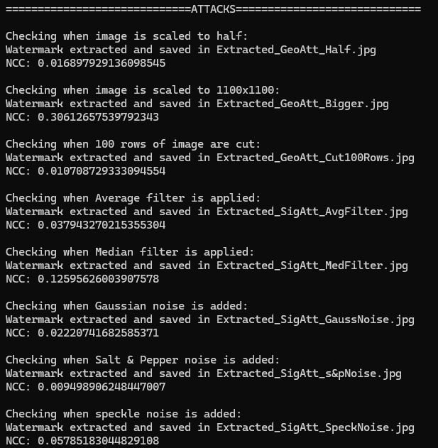

# DCT水印技术原理与实现

## 概述

DCT（离散余弦变换）水印是一种基于频域的隐形数字水印技术。该方案利用DCT变换将图像从空间域转换到频域，通过修改DCT系数来嵌入水印信息，具有较好的不可见性和一定的鲁棒性。

## 核心原理

### DCT变换基础

离散余弦变换将图像分解为不同频率的系数，其中DC系数（直流分量）dct[0][0]包含了图像块的平均亮度信息，是最重要的低频系数。本方案正是利用DC系数的重要性和稳定性来嵌入水印。

下面为DCT的公式：

***二维 DCT 公式（常用于图像处理）***

对于大小为 $M \times N$ 的图像块 $f(x, y)$，其二维 DCT 为：

$$
F(u, v) = \alpha(u) \alpha(v) \sum_{x=0}^{M-1} \sum_{y=0}^{N-1} f(x, y) \cdot \cos\left[ \frac{\pi (2x + 1)u}{2M} \right] \cdot \cos\left[ \frac{\pi (2y + 1)v}{2N} \right]
$$

其中：

$$
\alpha(u) = 
\begin{cases}
\sqrt{\frac{1}{M}}, & u = 0 \\
\sqrt{\frac{2}{M}}, & u > 0
\end{cases},
\quad
\alpha(v) = 
\begin{cases}
\sqrt{\frac{1}{N}}, & v = 0 \\
\sqrt{\frac{2}{N}}, & v > 0
\end{cases}
$$

***注解：***

* $f(x, y)$：输入图像的像素值；
* $F(u, v)$：频域系数（DCT 结果）；
* $\alpha(u), \alpha(v)$：正交归一化因子；

### 水印嵌入策略

通过修改8×8图像块的DC系数的奇偶性来嵌入水印信息：
- 水印像素值为255（白色）时，将DC系数修改为奇数
- 水印像素值为0（黑色）时，将DC系数修改为偶数

## 水印嵌入算法

### 函数定义
```
watermark_image(img, wm)
```

### 详细流程

1. **图像预处理**
   - 将输入图像分割成8×8大小的互不重叠块
   - 从边缘排除b_cut像素（通常为50像素）避免边界效应
   - 设总共获得n个有效块

2. **水印预处理**
   - 将水印图像转换为黑白单通道图像
   - 假设水印尺寸为w×h，包含pix = w×h个像素
   - 验证n ≥ pix，确保有足够的块来嵌入水印

3. **伪随机块选择**
   - 使用密钥k作为伪随机生成器的种子
   - 创建空集合st记录已使用的块
   - 对水印的每个像素，生成随机数y选择对应的图像块

4. **DCT变换与修改**
   - 计算选中块的DCT变换，得到dct_block
   - 提取DC系数：elem = dct_block[0][0]
   - 将elem除以因子fact（通常为8）
   - 根据水印像素值修改elem的奇偶性：
     - 像素值为255：将elem四舍五入为最接近的奇数
     - 像素值为0：将elem四舍五入为最接近的偶数
   - 将修改后的elem乘以fact并存回dct_block[0][0]

5. **逆变换与存储**
   - 计算修改后块的逆DCT变换
   - 将结果存储到带水印图像的对应位置
   - 保存最终的带水印图像

## 水印提取算法

### 函数定义
```
extract_watermark(img, ext_name)
```

### 详细流程

1. **图像分块**
   - 将带水印图像分割成8×8块
   - 排除边缘b_cut像素
   - 使用相同的密钥k初始化伪随机生成器

2. **水印提取**
   - 使用相同的伪随机序列选择对应的图像块
   - 计算每个块的DCT变换
   - 提取DC系数并除以因子fact
   - 判断最接近整数的奇偶性：
     - 奇数 → 水印像素值为255
     - 偶数 → 水印像素值为0

3. **质量评估**
   - 重构水印图像
   - 计算归一化互相关（NC）指数评估提取质量

## 技术细节

### 因子除法机制

使用fact因子除法是为了解决浮点数精度问题：

- DCT计算产生浮点值
- 图像保存时浮点数被转换为整数
- 重新读取时DCT值会有轻微变化
- 通过除以fact并乘以fact，增加了系数的变化容忍度（±fact/2）

### 采用冗余技术

对同一个水印图片对应的点位寻找多个块进行插入从而添加冗余，以增强抗鲁棒性

在提取水印时，进行投票机制，从而容忍更多的块被改变。

### 算法参数

- **块大小**：8×8像素
- **边界切除**：b_cut = 50像素
- **量化因子**：fact = 8
- **水印尺寸**：通常为64×64像素

## 鲁棒性测试

### 几何攻击

1. **缩放攻击**
   - 缩放至一半尺寸
   - 放大至双倍尺寸

2. **裁剪攻击**
   - 裁剪100行像素

### 信号处理攻击

1. **滤波攻击**
   - 平均滤波器
   - 中值滤波器

2. **噪声攻击**
   - 高斯噪声
   - 椒盐噪声
   - 斑点噪声

## 算法优缺点

### 优点

- 实现简单，计算复杂度低
- 利用DC系数的重要性，具有一定鲁棒性
- 不可见性较好，对图像质量影响小
- 可以进行盲提取

### 缺点

- 容量有限，只能嵌入较小的水印
- 对几何变换敏感
- 安全性较低，容易被恶意攻击
- 依赖于DC系数的奇偶性，容易被破解
- 实现水印后，图像亮度会有轻微变换

## 测试
***添加水印后***


***不处理情况下提取水印计算相似度***

nc指数：1.0

***攻击结果***



## 安全性分析

该算法存在明显的安全漏洞：攻击者可以通过随机改变所有块的DC系数奇偶性来破坏水印。这是因为算法的核心机制过于简单，缺乏加密保护措施。

## 应用场景

DCT水印技术适用于：
- 版权保护应用
- 图像认证
- 数字内容溯源
- 隐蔽通信

虽然该算法存在一些局限性，但作为数字水印技术的基础实现，为更复杂的水印方案提供了重要的理论基础和实践参考。