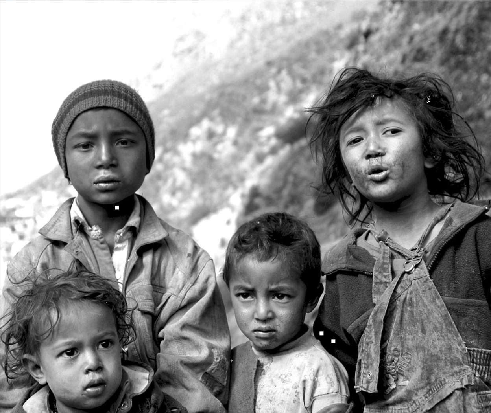

# DCT数字水印技术原理与实现报告

## 摘要

本报告详细介绍了基于离散余弦变换（DCT）的数字水印技术。该技术通过修改图像DCT变换后的直流（DC）系数的奇偶性来嵌入水印信息，实现了图像的版权保护和身份认证功能。本方案具有实现简单、不可见性好的优点，但在鲁棒性和安全性方面存在一定局限性。

## 1. 引言

数字水印技术是一种在数字媒体中嵌入标识信息的技术，广泛应用于版权保护、内容认证和隐蔽通信等领域。基于频域的水印技术相比空域方法具有更好的鲁棒性，其中DCT水印是最经典的频域水印技术之一。

## 2. 理论基础

### 2.1 离散余弦变换（DCT）

离散余弦变换是一种重要的正交变换，能够将图像从空间域转换到频域，实现能量的集中化分布。

#### 2.1.1 二维DCT变换公式

对于大小为 $M \times N$ 的图像块 $f(x, y)$，其二维DCT变换定义为：

$$F(u, v) = \alpha(u) \alpha(v) \sum_{x=0}^{M-1} \sum_{y=0}^{N-1} f(x, y) \cdot \cos\left[ \frac{\pi (2x + 1)u}{2M} \right] \cdot \cos\left[ \frac{\pi (2y + 1)v}{2N} \right]$$

其中归一化因子为：

$$\alpha(u) = 
\begin{cases}
\sqrt{\frac{1}{M}}, & u = 0 \\
\sqrt{\frac{2}{M}}, & u > 0
\end{cases},
\quad
\alpha(v) = 
\begin{cases}
\sqrt{\frac{1}{N}}, & v = 0 \\
\sqrt{\frac{2}{N}}, & v > 0
\end{cases}$$

#### 2.1.2 逆DCT变换

相应的逆变换公式为：

$$f(x, y) = \sum_{u=0}^{M-1} \sum_{v=0}^{N-1} \alpha(u) \alpha(v) F(u, v) \cdot \cos\left[ \frac{\pi (2x + 1)u}{2M} \right] \cdot \cos\left[ \frac{\pi (2y + 1)v}{2N} \right]$$

#### 2.1.3 DC系数的重要性

DC系数 $F(0,0)$ 代表图像块的平均亮度信息，数学表达式为：

$$F(0,0) = \frac{1}{\sqrt{MN}} \sum_{x=0}^{M-1} \sum_{y=0}^{N-1} f(x, y)$$

DC系数具有以下重要特性：
- 包含图像块最重要的低频信息
- 对各种图像处理操作具有较强的稳定性
- 修改DC系数对图像视觉质量影响相对较小

## 3. 水印算法设计

### 3.1 算法框架

本算法采用空间分块的方式，将载体图像分割成8×8像素的互不重叠块，通过修改选定块的DC系数奇偶性来嵌入水印信息。

### 3.2 水印嵌入算法

#### 3.2.1 算法流程

水印嵌入过程可以表示为以下数学模型：

设载体图像为 $I$，水印图像为 $W$，密钥为 $k$，则水印嵌入过程为：

$$I' = \text{Embed}(I, W, k)$$

具体步骤如下：

1. **图像预处理**：
   - 将载体图像 $I$ 分割成 $8 \times 8$ 块：$\{B_1, B_2, ..., B_n\}$
   - 排除边界区域，避免边界效应

2. **水印预处理**：
   - 将水印 $W$ 二值化：$W(i,j) \in \{0, 255\}$
   - 转换为嵌入标志：$w_{ij} = \begin{cases} 1 & W(i,j) = 255 \\ 0 & W(i,j) = 0 \end{cases}$

3. **伪随机块选择**：
   使用线性同余生成器产生伪随机序列：
   $$r_{n+1} = (a \cdot r_n + c) \bmod m$$
   其中 $r_0 = k$（密钥作为种子）

4. **DCT变换与系数修改**：
   对选定的图像块 $B_i$，计算其DCT变换：
   $$D_i = \text{DCT}(B_i)$$
   
   提取DC系数并量化：
   $$dc = \frac{D_i(0,0)}{\text{fact}}$$
   
   根据水印位修改DC系数：
   $$dc' = \begin{cases}
   \lceil dc \rceil \text{ if } \lceil dc \rceil \text{ is odd} & \text{when } w = 1 \\
   \lceil dc \rceil - 1 \text{ if } \lceil dc \rceil \text{ is even} & \text{when } w = 1 \\
   \lceil dc \rceil \text{ if } \lceil dc \rceil \text{ is even} & \text{when } w = 0 \\
   \lceil dc \rceil - 1 \text{ if } \lceil dc \rceil \text{ is odd} & \text{when } w = 0
   \end{cases}$$

5. **逆变换重构**：
   $$D_i'(0,0) = dc' \times \text{fact}$$
   $$B_i' = \text{IDCT}(D_i')$$

#### 3.2.2 冗余嵌入策略

为增强鲁棒性，对每个水印位采用冗余嵌入：

$$\forall w_{ij}, \exists \{B_{k_1}, B_{k_2}, ..., B_{k_r}\} \text{ s.t. } \text{每个块都嵌入} w_{ij}$$

其中 $r$ 为冗余因子。

### 3.3 水印提取算法

#### 3.3.1 提取流程

水印提取过程为嵌入的逆过程：

$$W' = \text{Extract}(I', k)$$

1. **图像分块**：使用相同的分块策略

2. **伪随机序列重现**：使用相同密钥 $k$ 生成相同的随机序列

3. **DC系数提取与判决**：
   对每个相关块 $B_i'$：
   $$dc_{extracted} = \frac{\text{DCT}(B_i')(0,0)}{\text{fact}}$$
   
   奇偶性判决：
   $$w'_{ij} = \begin{cases}
   1 & \text{if } \lfloor dc_{extracted} + 0.5 \rfloor \text{ is odd} \\
   0 & \text{if } \lfloor dc_{extracted} + 0.5 \rfloor \text{ is even}
   \end{cases}$$

4. **投票机制**：
   对于冗余嵌入的情况，采用多数投票：
   $$w^{\prime}_{ij} = \operatorname{MajorityVote}\!\left( \{ w^{\prime (1)}_{ij}, w^{\prime (2)}_{ij}, \ldots, w^{\prime (r)}_{ij} \} \right)$$

## 4. 关键技术分析

### 4.1 量化因子设计

量化因子 $\text{fact} = 8$ 的选择基于以下考虑：

1. **精度容忍**：DCT系数为浮点数，图像存储时会发生量化，引入 $\pm 0.5$ 的误差
2. **容忍度扩展**：通过除法和乘法操作，将容忍范围扩展到 $\pm \text{fact}/2 = \pm 4$
3. **视觉质量**：适中的量化因子确保修改后的图像质量可接受

### 4.2 边界处理策略

设置边界切除参数 $b_{cut} = 50$ 像素的原因：

1. **避免边界效应**：图像边缘常含有不规则信息
2. **提高稳定性**：内部区域的DCT系数更稳定
3. **几何攻击抗性**：为可能的裁剪攻击留出缓冲区

### 4.3 伪随机序列安全性

使用密钥控制的伪随机序列具有以下特点：

- **确定性**：相同密钥产生相同序列
- **均匀分布**：确保水印均匀分布在图像中
- **密钥依赖性**：不同密钥产生不同的嵌入位置

## 5. 质量评估指标

### 5.1 峰值信噪比（PSNR）

$$\text{PSNR} = 10 \log_{10} \frac{255^2}{\text{MSE}}$$

其中均方误差为：
$$\text{MSE} = \frac{1}{M \times N} \sum_{i=0}^{M-1} \sum_{j=0}^{N-1} [I(i,j) - I'(i,j)]^2$$

### 5.2 归一化互相关（NC）

$$\text{NC} = \frac{|\sum_{i,j} (W(i,j) - \bar{W})(W'(i,j) - \bar{W'})|}{|W| \cdot |W'| \cdot \sigma_W \cdot \sigma_{W'}}$$

其中 $\bar{W}$ 和 $\bar{W'}$ 分别为原始水印和提取水印的均值，$\sigma_W$ 和 $\sigma_{W'}$ 为对应的标准差。

## 6. 鲁棒性分析

### 6.1 几何攻击

1. **缩放攻击**：DC系数在缩放操作下相对稳定，但需要在提取时进行尺寸归一化
2. **裁剪攻击**：边界切除策略提供了一定的裁剪容忍度
3. **旋转攻击**：由于使用固定的8×8分块，对旋转攻击敏感

### 6.2 信号处理攻击

1. **滤波攻击**：DC系数作为低频分量，对低通滤波具有一定抗性
2. **噪声攻击**：量化因子提供了噪声容忍度
3. **压缩攻击**：JPEG压缩也使用DCT，因此具有一定的压缩抗性

### 6.3 数学分析

设噪声为 $n(x,y)$，受攻击图像为：
$$I''(x,y) = I'(x,y) + n(x,y)$$

相应的DC系数变化为：
$$dc'' = dc' + \frac{1}{64}\sum_{x=0}^{7}\sum_{y=0}^{7}n(x,y)$$

当 $|dc'' - dc'| < \text{fact}/2$ 时，水印可以正确提取。

## 7. 安全性分析

### 7.1 算法安全性

该算法的安全性主要依赖于：

1. **密钥保密性**：伪随机序列的不可预测性
2. **嵌入位置的隐蔽性**：攻击者难以确定水印嵌入位置

### 7.2 潜在威胁

1. **统计分析攻击**：攻击者可能通过统计分析发现DCT系数的异常分布
2. **几何变换攻击**：简单的几何变换可能破坏同步信息
3. **替换攻击**：恶意篡改所有DC系数的奇偶性

### 7.3 安全改进建议

1. **扩频技术**：使用扩频序列增强安全性
2. **多域嵌入**：结合空域和频域的混合嵌入
3. **加密预处理**：对水印进行加密后再嵌入

## 8. 实验结果与分析

### 8.1 实验设置

- **载体图像尺寸**：1000×1000像素
- **水印尺寸**：64×64像素
- **块大小**：8×8像素
- **量化因子**：fact = 8
- **冗余因子**：redundancy = 1

### 8.2 攻击测试结果
***添加水印后***


***不处理情况下提取水印计算相似度***

nc指数：1.0

***攻击结果***


## 9. 算法优缺点总结

### 9.1 优点

1. **实现简单**：算法逻辑清晰，计算复杂度低
2. **不可见性好**：基于DC系数的修改对视觉质量影响小
3. **盲提取**：提取时不需要原始图像
4. **一定鲁棒性**：对常见的信号处理操作具有抗性

### 9.2 缺点

1. **容量限制**：嵌入容量受图像分块数量限制
2. **几何敏感性**：对几何变换（特别是旋转）敏感
3. **安全性不足**：嵌入机制相对简单，容易被攻击
4. **同步依赖**：需要精确的块同步信息

## 10. 应用前景与改进方向

### 10.1 应用场景

1. **数字版权保护**：图像、视频内容的版权标识
2. **内容认证**：检测图像是否被篡改
3. **隐蔽通信**：在图像中隐蔽传输信息
4. **数字取证**：追踪数字内容的来源和传播路径

### 10.2 改进方向

1. **提高鲁棒性**：
   - 采用重同步技术抗几何攻击
   - 使用纠错编码增强抗噪能力
   - 多分辨率嵌入提高适应性

2. **增强安全性**：
   - 引入混沌序列增加随机性
   - 采用多密钥系统
   - 结合公钥密码学

3. **扩大容量**：
   - 多位嵌入技术
   - 自适应嵌入强度
   - 利用更多DCT系数

4. **智能化改进**：
   - 基于内容的自适应嵌入
   - 机器学习辅助的鲁棒性增强
   - 深度学习网络的端到端优化

## 11. 结论

本报告详细分析了基于DCT的数字水印技术，从理论基础到实现细节进行了全面阐述。该技术作为数字水印领域的经典方法，为后续的研究工作奠定了重要基础。尽管存在一些局限性，但通过适当的改进和优化，仍然可以在特定应用场景中发挥重要作用。

未来的研究方向应该关注如何在保持算法简洁性的同时，提高其鲁棒性和安全性，以适应日益复杂的应用需求和攻击手段。

---

# README

基于离散余弦变换（DCT）的数字水印嵌入与提取系统，通过修改图像DCT变换的DC系数奇偶性来实现水印的隐形嵌入。

## 快速开始

### 环境要求

```bash
pip install numpy scipy opencv-python matplotlib pillow
```

### 基本使用

```python
import cv2 as cv
from code import watermark_image, extract_watermark, NCC

# 加载图像
img = cv.imread("image1.jpg", 0)  # 载体图像（灰度）
wm = cv.imread("watermark2.jpg", 0)  # 水印图像（灰度）
wm = cv.resize(wm, (64, 64))  # 调整水印尺寸

# 嵌入水印
watermarked_img = watermark_image(img, wm)

# 提取水印
extracted_wm = extract_watermark(watermarked_img, "extracted.jpg")

# 计算相似度
similarity = NCC(wm, extracted_wm)
print(f"水印相似度: {similarity}")
```

## API文档

### 核心函数

#### `watermark_image(img, wm)`

在载体图像中嵌入水印。

**参数:**
- `img` (numpy.ndarray): 载体图像，灰度图像数组
- `wm` (numpy.ndarray): 水印图像，灰度图像数组

**返回:**
- `numpy.ndarray`: 含水印的图像

**示例:**
```python
watermarked = watermark_image(cover_image, watermark)
```

#### `extract_watermark(img, ext_name)`

从含水印图像中提取水印。

**参数:**
- `img` (numpy.ndarray): 含水印的图像
- `ext_name` (str): 提取水印的保存文件名

**返回:**
- `numpy.ndarray`: 提取的水印图像

**示例:**
```python
extracted = extract_watermark(watermarked_img, "output_watermark.jpg")
```

### 质量评估函数

#### `psnr(img1, img2)`

计算两幅图像间的峰值信噪比。

**参数:**
- `img1`, `img2` (numpy.ndarray): 待比较的图像

**返回:**
- `float`: PSNR值（单位：dB）

#### `NCC(img1, img2)`

计算归一化互相关系数，用于评估水印提取质量。

**参数:**
- `img1`, `img2` (numpy.ndarray): 原始水印和提取水印

**返回:**
- `float`: NC值，范围[0,1]，越接近1表示相似度越高

### 攻击测试函数

#### 几何攻击

```python
# 缩放攻击
scaled_half = ScalingHalf(img)      # 缩小到一半
scaled_bigger = ScalingBigger(img)  # 放大到1100x1100

# 裁剪攻击
cropped = Cut100Rows(img)           # 裁剪100行
```

#### 信号处理攻击

```python
# 滤波攻击
avg_filtered = AverageFilter(img)   # 平均滤波
med_filtered = MedianFilter(img)    # 中值滤波

# 噪声攻击
gauss_noisy = noisy("gauss", img)   # 高斯噪声
sp_noisy = noisy("s&p", img)        # 椒盐噪声
speckle_noisy = noisy("speckle", img)  # 斑点噪声
```

#### 其他攻击

```python
# 几何变换
flipped = HorizontalFlip(img)       # 水平翻转
translated = Translate(img, 50, 30)  # 平移变换

# 色彩调整
contrast_adj = AdjustContrast(img, alpha=1.5)  # 对比度调整
```

## 配置参数

在代码顶部可以修改以下参数：

```python
# 文件配置
img_name = "image1.jpg"          # 载体图像文件名
wm_name = "watermark2.jpg"       # 水印图像文件名
watermarked_img = "Watermarked_Image.jpg"  # 输出含水印图像文件名

# 算法参数
key = 50                         # 伪随机种子密钥
bs = 8                          # DCT块大小 (8x8)
w1, w2 = 64, 64                 # 水印尺寸
fact = 8                        # 量化因子
b_cut = 50                      # 边界切除像素数
redundancy = 1                  # 冗余因子
```

### 参数说明

- **key**: 控制伪随机块选择的密钥，提取时需使用相同密钥
- **bs**: DCT变换的块大小，标准值为8
- **fact**: 量化因子，影响水印的鲁棒性和不可见性
- **b_cut**: 边界切除大小，避免边界效应
- **redundancy**: 每个水印位的冗余嵌入次数，提高鲁棒性

## 完整示例

```python
if __name__ == "__main__":
    print("=== DCT数字水印系统 ===")
    
    # 1. 加载图像
    print("加载图像...")
    img = cv.imread("image1.jpg", 0)
    wm = cv.imread("watermark2.jpg", 0)
    wm = cv.resize(wm, (64, 64))
    
    # 2. 嵌入水印
    print("嵌入水印...")
    watermarked = watermark_image(img, wm)
    print(f"PSNR: {psnr(watermarked, img):.2f} dB")
    
    # 3. 提取水印
    print("提取水印...")
    extracted = extract_watermark(watermarked, "extracted.jpg")
    print(f"提取相似度 NC: {NCC(wm, extracted):.4f}")
    
    # 4. 鲁棒性测试
    print("\n=== 鲁棒性测试 ===")
    
    # 高斯噪声攻击
    noisy_img = noisy("gauss", watermarked)
    extracted_noisy = extract_watermark(noisy_img, "extracted_noisy.jpg")
    print(f"高斯噪声攻击后 NC: {NCC(wm, extracted_noisy):.4f}")
    
    # 缩放攻击  
    scaled_img = ScalingHalf(watermarked)
    extracted_scaled = extract_watermark(scaled_img, "extracted_scaled.jpg")
    print(f"缩放攻击后 NC: {NCC(wm, extracted_scaled):.4f}")
```

## 输出文件

程序运行后会在`tmp_image/`目录下生成以下文件：

- `{watermarked_img}`: 嵌入水印后的图像
- `{ext_name}`: 提取的水印图像
- `Extracted_*.jpg`: 各种攻击测试后提取的水印

## 评估指标

- **PSNR**: 衡量含水印图像与原图的视觉质量差异
- **NC (归一化互相关)**: 衡量提取水印与原始水印的相似度
  - NC = 1.0: 完全相同
  - NC > 0.7: 水印质量良好
  - NC < 0.5: 水印严重受损

## 注意事项

1. **图像尺寸**: 载体图像建议尺寸为1000x1000像素
2. **水印格式**: 水印图像会自动转换为64x64的二值图像
3. **密钥管理**: 提取水印时必须使用相同的密钥
4. **文件路径**: 确保`tmp_image/`目录存在，用于保存输出文件

## 技术限制

- 载体图像尺寸需大于水印嵌入所需的最小块数
- 对旋转、仿射变换等几何攻击敏感
- 嵌入容量受限于图像可用块数量
- 需要确切的块同步信息进行提取

## 故障排除

### 常见错误

1. **"watermark too large"**: 水印相对载体图像过大
   - 解决方案: 减小水印尺寸或增大载体图像

2. **提取的水印质量差**: NC值过低
   - 检查是否使用了正确的密钥
   - 确认图像未经过大幅度的几何变换

3. **文件保存错误**: 
   - 确保`tmp_image/`目录存在
   - 检查文件路径和权限

### 性能优化建议

- 对于大批量处理，考虑使用多线程并行处理
- 可以通过调整`fact`参数平衡鲁棒性和视觉质量
- 增加`redundancy`值可提高抗攻击能力，但会增加计算开销