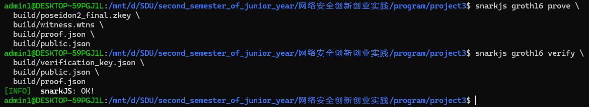

# 用circom实现poseidon2哈希算法的电路

## 任务概述

使用circom实现poseidon2哈希算法的电路（其中哈希算法参数(n,t,d)=(256,3,5)），然后使用SnarkJS工具运行circom代码，
构建基于Groth16算法的poseidon2哈希函数零知识证明协议并验证

## Groth16 简要介绍

### 1. 核心思想
- **类型**：非交互式 zk‑SNARK（零知识简洁非交互式论证）。  
- **目标**：在不泄露私有输入（witness）的前提下，对任何可表示为 R1CS（Rank‑1 Constraint System）的计算关系生成极短的证明，并能快速验证。  
- **技术基础**：  
  - 多项式承诺（Polynomial Commitments）  
  - 椭圆曲线双线性配对（Bilinear Pairing）  
  - Fiat–Shamir 变换（将交互式协议非交互化）

### 2. 基本流程
1. **Trusted Setup（可信设置）**  
   - 输入：电路的 R1CS 文件 + 通用憑證（如 Powers‑of‑Tau）。  
   - 输出：  
     - **Proving Key (PK)**：用于生成证明  
     - **Verifying Key (VK)**：用于验证证明  
2. **Prove（生成证明）**  
   - 输入：PK + 私有输入（witness） + 公开输入  
   - 步骤：  
     1. 构造一系列多项式承诺  
     2. 对承诺值执行 Fiat–Shamir 哈希，生成随机挑战  
     3. 计算配对相关元素  
   - 输出：固定大小 (~200 字节) 的 **Proof**  
3. **Verify（验证证明）**  
   - 输入：VK + 公开输入 + Proof  
   - 步骤：  
     - 执行若干次椭圆曲线配对检验  
   - 输出：`true` 或 `false`

### 3. 优缺点
- **优点**  
  - 证明体积小（≈200 B），与电路复杂度无关  
  - 验证快速（几次配对运算）  
  - 工具链成熟（Circom + SnarkJS、libsnark、Arkworks 等）  
- **缺点**  
  - 需要 per‑circuit 的 Trusted Setup  
  - 不原生支持递归证明（需额外构造）

### 4. 典型应用
- **隐私币**：Zcash  
- **Layer‑2 扩容**：zkSync v1、StarkNet（部分方案）  
- **通用 ZK电路**：Circom/SnarkJS 平台上的各种自定义证明  

## 3.证明流程

### 1.编译电路
```
circom poseidon2.circom --r1cs --wasm --sym -o build/
```

### 2.Groth16初始化
```
# 1) 初次 setup：.r1cs + ptau → .zkey（将通用参数“定制化”到特定的电路上，生成一个与电路结构绑定的初始密钥文件。）
snarkjs groth16 setup build/poseidon2.r1cs \
  powersOfTau28_hez_final_10.ptau \
  build/poseidon2_0000.zkey

# 2) 贡献熵（增强证明系统在理论上的安全性，将贡献熵设置为helloworld）
snarkjs zkey contribute \
  build/poseidon2_0000.zkey \
  build/poseidon2_final.zkey \
  --name="First contribution" \
  -v

# 3) 导出 Verification Key（用于链上或本地验证）
snarkjs zkey export verificationkey \
  build/poseidon2_final.zkey \
  build/verification_key.json

```

### 3.生成input.json文件（指定输入以及期望的hash结果）
可以先随机写入两个输入（根据给定接口），形如：
```
{
    "in_message": ["1234567890123456", "1111111111111111"],
    "expected_hash_output": "0"
}
```
然后直接进行第四步，根据报错结果查看内容，但是对于某些版本来说，可能这个方案无法行得通，例如报错：
```
/program/project3/build/poseidon2_js/witness_calculator.js:166
                    throw new Error(err);
                          ^

Error: Error: Assert Failed.
Error in template Poseidon2Hash_65 line: 117

    at /mnt/d/SDU/second_semester_of_junior_year/网络安全创新创业实践/program/project3/build/poseidon2_js/witness_calculator.js:166:27
    at Array.forEach (<anonymous>)
    at WitnessCalculator._doCalculateWitness (/mnt/d/SDU/second_semester_of_junior_year/网络安全创新创业实践/program/project3/build/poseidon2_js/witness_calculator.js:141:14)
    at WitnessCalculator.calculateWitness (/mnt/d/SDU/second_semester_of_junior_year/网络安全创新创业实践/program/project3/build/poseidon2_js/witness_calculator.js:179:20)
    at /mnt/d/SDU/second_semester_of_junior_year/网络安全创新创业实践/program/project3/build/poseidon2_js/generate_witness.js:11:39

Node.js v22.17.0
```
此时，只能选择修改.circom文件，将`signal input expected_hash_output;`修改为`signal output actual_hash_output;`，将`expected_hash_output === states_history[TOTAL_ROUNDS][0];`
修改为`actual_hash_output <== states_history[TOTAL_ROUNDS][0];`，然后重复1,2两步后，修改json输入（去除第二个参数），进行第4步，在成功运行后，会发现build文件夹中多出了witness.wtns文件，使用指令：
```
snarkjs wtns export json build/witness.wtns build/witness.json
```
将其转换为json格式并查看，得到最终的生成结果，注意，第二个参数为hash函数输出结果

### 4.生成witness
```
node build/poseidon2_js/generate_witness.js \
  build/poseidon2_js/poseidon2.wasm \
  input.json \
  build/witness.wtns
```
成功后会在 build/poseidon2_js/ 目录下看到 witness.wtns。

### 5.生成proof
```
snarkjs groth16 prove \
  build/poseidon2_final.zkey \
  build/witness.wtns \
  build/proof.json \
  build/public.json
```
其中proof.json：零知识证明  public.json：公开输入（包含 hashPub）

### 6.验证 Proof
```
snarkjs groth16 verify \
  build/verification_key.json \
  build/public.json \
  build/proof.json
```
可以看到验证成功：



