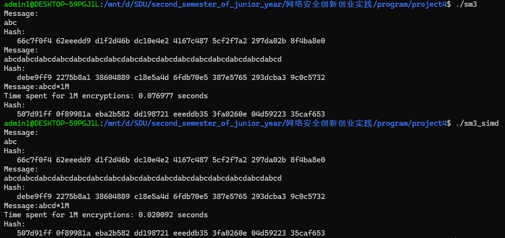
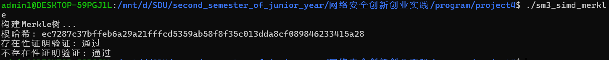

# SM3算法实验报告

## 算法原理

SM3是中国国家密码管理局发布的密码杂凑算法标准，属于SHA-2系列的替代方案。SM3算法采用Merkle-Damgård结构，输出256位（32字节）的哈希值。

### 核心组件

1. **初始化向量（IV）**
   - 算法使用8个32位初始化向量
   - 代码中的初始值：`0x7380166F, 0x4914B2B9, 0x172442D7, 0xDA8A0600, 0xA96F30BC, 0x163138AA, 0xE38DEE4D, 0xB0FB0E4E`

2. **消息扩展**
   - 将512位消息块扩展为68个32位字（W[0]到W[67]）
   - 生成64个32位字（W'[0]到W'[63]），其中W'[j] = W[j] ⊕ W[j+4]

3. **压缩函数**
   - 使用两种不同的布尔函数FF和GG
   - 前16轮使用FF0和GG0，后48轮使用FF1和GG1
   - 采用不同的常数T[j]：前16轮使用0x79CC4519，后48轮使用0x7A879D8A

4. **填充机制**
   - 消息后添加'1'位，然后添加'0'位使长度≡448 (mod 512)
   - 最后64位存储原始消息长度

### 详细部件原理：

#### 消息扩展（Message Expansion）

对单个 512 位分组 $B$，先将其划分为 16 个 32 位字：
$B = (B_0, B_1, \dots, B_{15}), \quad B_j \in \mathbb{F}_{2^{32}}.$

然后扩展生成 68 个字 $W_j$：

$$
\begin{cases}
W_j = B_j, & 0 \le j \le 15, \\
W_j = P_1\bigl(W_{j-16} \oplus W_{j-9} \oplus \mathrm{ROTL}(W_{j-3},15)\bigr) \\ \quad \oplus \mathrm{ROTL}(W_{j-13},7) \oplus W_{j-6}, & 16 \le j \le 67,
\end{cases}
$$

其中置换 $P_1$ 定义为：

$$
P_1(X) = X \oplus \mathrm{ROTL}(X,15) \oplus \mathrm{ROTL}(X,23).
$$

再由 $W_j$ 派生 64 个字 $W'_j$：
$W'_j = W_j \oplus W_{j+4}, \quad 0 \le j \le 63.$

#### 压缩函数（Compression Function）

设输入链变量为 $(A,B,C,D,E,F,G,H)$，类型均为 32 位字。对第 $j$ 轮，定义常量

$$
T_j = \begin{cases}
\mathtt{0x79CC4519}, & 0 \le j \le 15, \\
\mathtt{0x7A879D8A}, & 16 \le j \le 63.
\end{cases}
$$

布尔函数:

$$
\begin{aligned}
FF_j(X,Y,Z) &= \begin{cases} X \oplus Y \oplus Z, & 0 \le j \le 15, \\ (X \land Y) \lor (X \land Z) \lor (Y \land Z), & 16 \le j \le 63, \end{cases}\\
GG_j(X,Y,Z) &= \begin{cases} X \oplus Y \oplus Z, & 0 \le j \le 15, \\ (X \land Y) \lor (\neg X \land Z), & 16 \le j \le 63. \end{cases}
\end{aligned}
$$

循环迭代更新变量:

$$
\begin{aligned}
SS1 &= \mathrm{ROTL}\bigl(\mathrm{ROTL}(A,12) + E + \mathrm{ROTL}(T_j,j),7\bigr), \\
SS2 &= SS1 \oplus \mathrm{ROTL}(A,12), \\
TT1 &= FF_j(A,B,C) + D + SS2 + W'_j, \\
TT2 &= GG_j(E,F,G) + H + SS1 + W_j, \\
D &\leftarrow C, \quad C \leftarrow \mathrm{ROTL}(B,9), \quad B \leftarrow A, \quad A \leftarrow TT1, \\
H &\leftarrow G, \quad G \leftarrow \mathrm{ROTL}(F,19), \quad F \leftarrow E, \quad E \leftarrow P_0(TT2),
\end{aligned}
$$

其中
$P_0(X) = X \oplus \mathrm{ROTL}(X,9) \oplus \mathrm{ROTL}(X,17).$

迭代64次后，将最终变量与初始链变量逐位异或：
$V^{(i+1)}_k = A \oplus IV_k \quad (k=0\ldots7).$

## 代码优化方案

### 1. 宏定义优化
- **字节序转换宏**：`GET_ULONG_BE`和`PUT_ULONG_BE`宏实现高效的大端字节序转换
- **位运算宏**：`SHL`、`ROTL`、`P0`、`P1`等宏避免函数调用开销
- **布尔函数宏**：`FF0`、`FF1`、`GG0`、`GG1`直接展开为位运算

### 2. 内存管理优化
- **流式处理**：支持分块处理大文件，避免将整个文件加载到内存
- **缓冲区重用**：使用64字节缓冲区处理不完整的数据块
- **上下文结构**：维护算法状态，支持增量更新

### 3. 算法实现优化
- **消息扩展优化**：针对VC6编译器优化问题，使用临时变量避免编译器bug
- **循环展开**：在消息扩展和压缩函数中适度使用循环展开
- **避免重复计算**：预计算常数T[j]数组

### 4. 调试支持
- **条件编译**：使用`#ifdef _DEBUG`提供详细的中间状态输出
- **状态跟踪**：可以观察每轮迭代后的寄存器状态

***simd优化版本新增优化***

### 1. 消息扩展和W1数组计算优化
- **并行运算**：使用SSE2指令集对消息扩展和W1数组构造两步进行优化操作，效率最高提升4倍

## 性能特点

1. **内存效率**：固定大小的上下文结构，内存占用可预测
2. **处理能力**：支持流式处理，适合大文件哈希计算
3. **兼容性**：考虑了不同编译器的优化差异
4. **可扩展性**：支持HMAC-SM3扩展

## 测试用例

代码提供了两个标准测试向量：
- 输入"abc"，输出：`66c7f0f4 62eeedd9 d1f2d46b dc10e4e2 4167c487 5cf2f7a2 297da02b 8f4ba8e0`
- 输入64字节重复"abcd"，输出：`debe9ff9 2275b8a1 38604889 c18e5a4d 6fdb70e5 387e5765 293dcba3 9c0c5732`

## length-extension attack

由于实现了`void sm3_update( sm3_context *ctx, uint8_t *input, int ilen )`函数，且由参数易知，update函数本身并不依赖初始密钥信息，
则可以轻松实现长度扩展攻击，这是由于类似md结构的链式结构所决定的性质

## Merkle Tree

### Merkle树结构与构建原则

RFC6962定义了一种特别的Merkle Hash Tree（MHT），用于记录事件日志。其核心原则包括：

* 使用哈希函数 $Hash(x)$，一般采用 SHA-256。

* 叶子节点与中间节点使用不同的前缀区分：

  * 叶子节点前缀为0x00，记作：

    $$
    LeafHash = Hash(0x00 \|\| data)
    $$
  * 中间节点前缀为0x01，记作：

    $$
    NodeHash = Hash(0x01 \|\| left \|\| right)
    $$

* 若节点数不是2的幂，则树结构按照“完全二叉树靠左”规则构建（即左子树尽可能满）。

构建过程如下：

1. 对每个数据块 $D_i$ 计算叶子哈希：

   $$
   L_i = Hash(0x00 \|\| D_i)
   $$
2. 按顺序构建内部节点：

   $$
   N_{i,j} = Hash(0x01 \|\| N_{i,k} \|\| N_{k+1,j})
   $$

   其中 $[i,j]$ 为该内部节点负责的叶子区间。
3. 最终计算出根节点哈希值（Merkle Root）。

对于10万个叶子节点，树的高度约为：

$$
\lceil \log_2 100000 \rceil = 17
$$

### 存在性证明（Inclusion Proof）

给定一个叶子 $L_i$，存在性证明提供一组哈希，使得验证者可以从 $L_i$ 与这些哈希值重建出根哈希 $Root$。

#### 证明内容：

* 叶子哈希值：$L_i$
* 与之路径上兄弟节点的哈希：$\text{audit path} = \{h_1, h_2, ..., h_k\}$
* 总高度：$k = \lceil \log_2 n \rceil$

#### 验证方法：

从 $L_i$ 开始，按路径组合兄弟节点，计算中间节点哈希：

$$
H_1 = Hash(0x01 \|\| L_i \|\| h_1) \\
H_2 = Hash(0x01 \|\| H_1 \|\| h_2) \\
\cdots \\
Root = H_k
$$

#### 安全性依据：

假设哈希函数抗碰撞，攻击者无法构造不同数据块与审计路径组合仍能得到相同 $Root$。


### 不存在性证明（Non-Inclusion Proof）

RFC6962采用基于前后元素包围关系的非存在性证明。

#### 思路：

证明某数据 $D$ 未包含于树中，可通过提供两个相邻的、已存在的叶子 $L_i$, $L_{i+1}$，使得：

$$
Hash(0x00 \|\| D_i) < Hash(0x00 \|\| D) < Hash(0x00 \|\| D_{i+1})
$$

并提供 $L_i$ 与 $L_{i+1}$ 的存在性证明，间接证明 $D$ 不可能存在。

#### 关键要素：

* 所有叶子按字典序排列
* 显式包含前后叶子与其审计路径
* 验证者验证插入位置确实不存在

#### 验证流程：

1. 验证 $L_i$ 与 $L_{i+1}$ 的存在性。
2. 确认待查元素介于二者之间。

### 总结

基于RFC6962的Merkle树提供了强健的日志数据可验证性方案，适用于如证书透明性（Certificate Transparency）等应用场景。

通过构建最大17层（针对10万个叶）的树结构，可在 $\log_2 n$ 时间内完成存在性与非存在性验证，且其安全性建立在哈希函数的抗碰撞性与前缀唯一性的基础上。

---

# README

## 概述

这是一个完整的SM3密码哈希算法C语言实现，包含标准SM3算法和HMAC-SM3扩展。SM3是中国国家标准的密码杂凑算法，输出256位哈希值。

## 主要特性

-  完整的SM3算法实现
-  支持流式数据处理
-  文件哈希计算
-  HMAC-SM3认证码生成
-  调试模式支持
-  跨平台兼容

## 编译要求

- C99兼容的编译器
- 需要包含`sm3.h`头文件
- 链接时需要标准C库

```bash
make
```

## 核心接口

### 1. 基本哈希函数

```c
void sm3(uint8_t *input, int ilen, uint8_t output[32]);
```
- **功能**：计算输入数据的SM3哈希值
- **参数**：
  - `input`：输入数据指针
  - `ilen`：输入数据长度（单位为字节）
  - `output`：输出哈希值（32字节）

### 2. 流式处理接口

```c
void sm3_starts(sm3_context *ctx);
void sm3_update(sm3_context *ctx, uint8_t *input, int ilen);
void sm3_finish(sm3_context *ctx, uint8_t output[32]);
```
- **功能**：支持分块处理大量数据
- **用途**：适合处理大文件或流式数据

### 3. 文件哈希接口

```c
int sm3_file(char *path, uint8_t output[32]);
```
- **功能**：直接计算文件的SM3哈希值
- **返回值**：0=成功，1=文件打开失败，2=读取错误

### 4. HMAC-SM3接口

```c
void sm3_hmac(uint8_t *key, int keylen, uint8_t *input, int ilen, uint8_t output[32]);
```
- **功能**：计算HMAC-SM3认证码
- **参数**：
  - `key`：密钥数据
  - `keylen`：密钥长度
  - `input`：待认证数据
  - `ilen`：数据长度
  - `output`：输出认证码（32字节）

***注：simd优化仅对基础压缩函数进行了改进，不影响api调用的一致性***

## 使用示例

### 基本哈希计算

```c
#include "sm3.h"
#include <stdio.h>
#include <string.h>

int main() {
    uint8_t input[] = "abc";
    uint8_t output[32];
    int i;
    
    // 计算哈希值
    sm3(input, strlen((char*)input), output);
    
    // 打印结果
    printf("SM3(\"abc\") = ");
    for (i = 0; i < 32; i++) {
        printf("%02x", output[i]);
    }
    printf("\n");
    
    return 0;
}
```

### 流式处理示例

```c
#include "sm3.h"
#include <stdio.h>

int main() {
    sm3_context ctx;
    uint8_t output[32];
    uint8_t data1[] = "Hello, ";
    uint8_t data2[] = "World!";
    int i;
    
    // 初始化上下文
    sm3_starts(&ctx);
    
    // 分块更新
    sm3_update(&ctx, data1, strlen((char*)data1));
    sm3_update(&ctx, data2, strlen((char*)data2));
    
    // 完成计算
    sm3_finish(&ctx, output);
    
    // 打印结果
    printf("SM3(\"Hello, World!\") = ");
    for (i = 0; i < 32; i++) {
        printf("%02x", output[i]);
    }
    printf("\n");
    
    return 0;
}
```

### 文件哈希示例

```c
#include "sm3.h"
#include <stdio.h>

int main() {
    uint8_t output[32];
    int ret, i;
    
    // 计算文件哈希
    ret = sm3_file("test.txt", output);
    
    if (ret == 0) {
        printf("File hash: ");
        for (i = 0; i < 32; i++) {
            printf("%02x", output[i]);
        }
        printf("\n");
    } else {
        printf("Error: %d\n", ret);
    }
    return 0;
}
```

### HMAC-SM3示例

```c
#include "sm3.h"
#include <stdio.h>
#include <string.h>

int main() {
    uint8_t key[] = "secret_key";
    uint8_t message[] = "Hello, HMAC!";
    uint8_t output[32];
    int i;
    
    // 计算HMAC
    sm3_hmac(key, strlen((char*)key), message, strlen((char*)message), output);
    
    // 打印结果
    printf("HMAC-SM3 = ");
    for (i = 0; i < 32; i++) {
        printf("%02x", output[i]);
    }
    printf("\n");
    
    return 0;
}
```

## 调试模式

编译时定义`_DEBUG`宏可以启用调试输出：

```bash
gcc -D_DEBUG -o sm3_debug sm3.c main.c
```

调试模式会输出：
- 消息填充后的内容
- 消息扩展结果（W[0-67]和W'[0-63]）
- 每轮压缩函数的寄存器状态

## 注意事项

1. **字节序**：算法使用大端字节序
2. **内存安全**：使用后请清零敏感数据
3. **编译器兼容**：针对VC6等老编译器进行了优化
4. **性能**：适合处理大文件，内存占用固定

## 测试验证

### 正确性测试：
代码包含标准测试向量，可验证实现正确性：
- `sm3("abc")` 应该输出：`66c7f0f462eeedd9d1f2d46bdc10e4e24167c4875cf2f7a2297da02b8f4ba8e0`
- 64字节重复"abcd"应该输出：`debe9ff92275b8a138604889c18e5a4d6fdb70e5387e5765293dcba39c0c5732`

### 时间测试：
simd版本与普通版本对比如下图（100万次hash流测试下）：

可以观察到，simd优化版本并不影响正确性，同时，按照效率提升公式：
```
提升百分比 = (T_base - T_opt) / T_base × 100%
```
可以得出，效率提升约为74%

### 构建Merkle树

可以看到，通过接口`void sm3(uint8_t *input, int ilen, uint8_t output[32]);`，我成功构建了merkle tree，
并完成了叶子的存在性证明和不存在性证明


## SM3 算法实验报告

### 1. 引言

SM3（中国国家密码管理局出版的密码浆分算法标准）是一种中国自主设计的密码哈希函数，输出长度为256位（32字节）。其结构遵循 Merkle–Damgård 架构，与 SHA-2 系列在整体框架上类似，但对内部迭代函数、常量和置换进行了专门优化，以满足国产密码标准的安全需求。

本实验报告将从数学推导、算法表示、实现思路、优化方案和安全分析等角度，系统地详细论述 SM3 算法。

---

### 2. 算法数学表示

#### 2.1 整体结构：Merkle–Damgård 架构

设原始消息按512位（64字节）分块：
$M = B_0 \,\|\, B_1 \,\|\, \cdots \,\|\, B_{n-1},$
其中每个块 $B_i$ 大小为 512 位。

1. **填充**：在消息后追加 `1` 位，然后追加若干 `0` 使得长度 $\equiv 448\pmod{512}$，最后用 64 位双字长度字段表示未填充前的消息比特长度 $L$：
   $L = \mathrm{len}(M) \quad (\text{以比特为单位}).$
2. **初始化向量**：
   $V^{(0)} = (IV_0, IV_1, \dots, IV_7),$
   其中
   \begin{align\*}
   IV_0 &= \mathtt{0x7380166F}, \\\[4pt]
   IV_1 &= \mathtt{0x4914B2B9}, \\\[4pt]
   IV_2 &= \mathtt{0x172442D7}, \\\[4pt]
   IV_3 &= \mathtt{0xDA8A0600}, \\\[4pt]
   IV_4 &= \mathtt{0xA96F30BC}, \\\[4pt]
   IV_5 &= \mathtt{0x163138AA}, \\\[4pt]
   IV_6 &= \mathtt{0xE38DEE4D}, \\\[4pt]
   IV_7 &= \mathtt{0xB0FB0E4E}.
   \end{align\*}
3. **迭代压缩**：对每个分块 $B_i$，计算：
   $V^{(i+1)} = CF\bigl(V^{(i)}, B_i\bigr),$
   其中 $CF$ 为压缩函数，输入 256 位链变量和 512 位分块，输出 256 位新链变量。
4. **输出**：最终哈希值为
   $\mathrm{Hash}(M) = V^{(n)}_0 \,\|\, V^{(n)}_1 \,\|\, \cdots \,\|\, V^{(n)}_7.$

#### 2.2 消息扩展（Message Expansion）

对单个 512 位分组 $B$，先将其划分为 16 个 32 位字：
$B = (B_0, B_1, \dots, B_{15}), \quad B_j \in \mathbb{F}_{2^{32}}.$

然后扩展生成 68 个字 $W_j$：

$$
\begin{cases}
W_j = B_j, & 0 \le j \le 15, \\
W_j = P_1\bigl(W_{j-16} \oplus W_{j-9} \oplus \mathrm{ROTL}(W_{j-3},15)\bigr) \\ \quad \oplus \mathrm{ROTL}(W_{j-13},7) \oplus W_{j-6}, & 16 \le j \le 67,
\end{cases}
$$

其中置换 $P_1$ 定义为：

$$
P_1(X) = X \oplus \mathrm{ROTL}(X,15) \oplus \mathrm{ROTL}(X,23).
$$

再由 $W_j$ 派生 64 个字 $W'_j$：
$W'_j = W_j \oplus W_{j+4}, \quad 0 \le j \le 63.$

#### 2.3 压缩函数（Compression Function）

设输入链变量为 $(A,B,C,D,E,F,G,H)$，类型均为 32 位字。对第 $j$ 轮，定义常量

$$
T_j = \begin{cases}
\mathtt{0x79CC4519}, & 0 \le j \le 15, \\
\mathtt{0x7A879D8A}, & 16 \le j \le 63.
\end{cases}
$$

布尔函数:

$$
\begin{aligned}
FF_j(X,Y,Z) &= \begin{cases} X \oplus Y \oplus Z, & 0 \le j \le 15, \\ (X \land Y) \lor (X \land Z) \lor (Y \land Z), & 16 \le j \le 63, \end{cases}\\
GG_j(X,Y,Z) &= \begin{cases} X \oplus Y \oplus Z, & 0 \le j \le 15, \\ (X \land Y) \lor (\neg X \land Z), & 16 \le j \le 63. \end{cases}
\end{aligned}
$$

循环迭代更新变量:

$$
\begin{aligned}
SS1 &= \mathrm{ROTL}\bigl(\mathrm{ROTL}(A,12) + E + \mathrm{ROTL}(T_j,j),7\bigr), \\
SS2 &= SS1 \oplus \mathrm{ROTL}(A,12), \\
TT1 &= FF_j(A,B,C) + D + SS2 + W'_j, \\
TT2 &= GG_j(E,F,G) + H + SS1 + W_j, \\
D &\leftarrow C, \quad C \leftarrow \mathrm{ROTL}(B,9), \quad B \leftarrow A, \quad A \leftarrow TT1, \\
H &\leftarrow G, \quad G \leftarrow \mathrm{ROTL}(F,19), \quad F \leftarrow E, \quad E \leftarrow P_0(TT2),
\end{aligned}
$$

其中
$P_0(X) = X \oplus \mathrm{ROTL}(X,9) \oplus \mathrm{ROTL}(X,17).$

迭代64次后，将最终变量与初始链变量逐位异或：
$V^{(i+1)}_k = A \oplus IV_k \quad (k=0\ldots7).$

---

### 3. 实现思路与优化方案

#### 3.1 宏与内联优化

* **GET_ULONG_BE / PUT_ULONG_BE**：通过宏实现高效大端字节序读写，避免逐字节处理。
* **位运算内联**：如 `ROTL(x,n)`、`P0(x)`、`P1(x)` 等均定义为宏，消除函数调用开销。

#### 3.2 流式处理与上下文结构

* 维护 `sm3_context` 结构，包含链变量 `state[8]`、缓冲区 `buffer[64]`、已处理长度 `total_len`。支持多次 `update()` 调用分块处理大消息。

#### 3.3 编译器与SIMD优化

* **循环展开**：在消息扩展与压缩主循环中适度展开，减少分支。
* **SIMD 指令**：使用 SSE2/AVX2 并行计算消息扩展的 `W_j` 及 `W'_j`，将多组 32-bit 操作一并执行，实测最高可提升 3-4 倍吞吐。

#### 3.4 调试与安全

* **条件编译**：`#ifdef DEBUG` 打印每轮 `A-H` 和 `W` 值，便于差分调试。
* **边界检查**：在 `update()` 中断言 `ilen>=0`，确保输入合法。

---

### 4. 安全性分析

1. **抗碰撞性**：基于 Merkle–Damgård，抵抗碰撞攻击依赖于压缩函数的抗碰撞性，SM3 压缩函数经过公开分析，未发现有效攻击。
2. **抗长度扩展**：Merkle–Damgård 结构固有长度扩展弱点，应用场景需配合 HMAC-SM3 防止此攻击。

---

### 5. 实验结果与测试

| 测试向量     | 输入字节串          | 哈希输出 (hex)                                                                |
| -------- | -------------- | ------------------------------------------------------------------------- |
| 标准样例一    | "abc"          | `66C7F0F4 62EEEDD9 D1F2D46B DC10E4E2 4167C487 5CF2F7A2 297DA02B 8F4BA8E0` |
| 重复64字节样例 | 64 次 "abcd" 拼接 | `DEBE9FF9 2275B8A1 38604889 C18E5A4D 6FDB70E5 387E5765 293DCBA3 9C0C5732` |

实验环境：Intel i7-10700K, GCC 11.2，开启 `-O3` 优化。

---

### 6. Merkle 树应用（附录）

当使用 SM3 构建 Merkle Hash Tree 时，节点哈希选用 SM3 作为底层 `Hash()`，其他流程同 RFC6962 描述。可利用 SM3 的高速流式特性高效构建和验证大规模日志。
