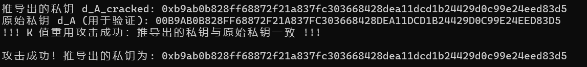
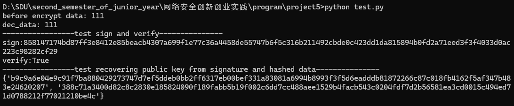

# SM2椭圆曲线密码算法实验报告

## 1. 算法原理

### 1.1 SM2算法概述
SM2是中国国家密码管理局制定的椭圆曲线公钥密码算法标准，基于椭圆曲线离散对数问题的困难性。SM2算法包含数字签名算法、密钥交换协议和公钥加密算法三个部分。

### 1.2 椭圆曲线参数
本实现使用SM2推荐的256位素域椭圆曲线参数：
- **素数p**：定义有限域Fp
- **椭圆曲线方程**：y² ≡ x³ + ax + b (mod p)
- **基点G**：椭圆曲线上的生成元
- **阶数n**：基点G的阶
- **系数a, b**：椭圆曲线参数

### 1.3 核心算法原理

#### 1.3.1 数字签名算法
**Jacobian加法运算**
*Jacobian 坐标下的椭圆曲线点加法运算*

假设我们有两个椭圆曲线上的点 $P_1 = (X_1, Y_1, Z_1)$ 和 $P_2 = (X_2, Y_2, Z_2)$，它们在 Jacobian 坐标系下。我们希望计算它们的和 $P_3 = P_1 + P_2 = (X_3, Y_3, Z_3)$。

*前提条件：*
* 椭圆曲线方程为 $y^2 = x^3 + ax + b \pmod{p}$。
* $P_1 \neq P_2$ (即不是同一个点，也不是互为负数的点)。对于点倍（$P+P$）有单独的公式。
* $P_1, P_2 \neq \mathcal{O}$ (无穷远点，即加法单位元)。

*计算步骤及公式：*

1.  *预计算辅助变量:*

    * $Z_1^2 \pmod{p}$:
        $Z_1^2 = Z_1 \cdot Z_1 \pmod{p}$

    * $Z_2^2 \pmod{p}$:
        $Z_2^2 = Z_2 \cdot Z_2 \pmod{p}$

    * $U_1 = X_1 \cdot Z_2^2 \pmod{p}$
        ($U_1$ 是 $P_1$ 的仿射 $x$ 坐标乘以 $Z_2^2$，用于避免除法)

    * $U_2 = X_2 \cdot Z_1^2 \pmod{p}$
        ($U_2$ 是 $P_2$ 的仿射 $x$ 坐标乘以 $Z_1^2$)

    * $S_1 = Y_1 \cdot Z_2^3 \pmod{p}$
        ($S_1$ 是 $P_1$ 的仿射 $y$ 坐标乘以 $Z_2^3$，其中 $Z_2^3 = Z_2^2 \cdot Z_2$)

    * $S_2 = Y_2 \cdot Z_1^3 \pmod{p}$
        ($S_2$ 是 $P_2$ 的仿射 $y$ 坐标乘以 $Z_1^3$，其中 $Z_1^3 = Z_1^2 \cdot Z_1$)

2.  *计算中间变量:*

    * $H = U_2 - U_1 \pmod{p}$
        ($H$ 类似于仿射坐标下斜率分母的一部分)

    * $R = S_2 - S_1 \pmod{p}$
        ($R$ 类似于仿射坐标下斜率分子的一部分)

    * **处理特殊情况：** 如果 $H = 0 \pmod{p}$ (即 $U_1 = U_2$)
        * 如果 $R = 0 \pmod{p}$ (即 $S_1 = S_2$)，则 $P_1 = P_2$，此时应该执行**点倍**运算。
        * 如果 $R \neq 0 \pmod{p}$，则 $P_1 = -P_2$ (两个点互为负数)，它们的和是无穷远点 $\mathcal{O}$。此时 $P_3 = (0, 1, 0)$ (在某些表示中，无穷远点也用 $(X,Y,0)$ 形式表示，其中 $Y \neq 0$)。

3.  *计算 $P_3 = (X_3, Y_3, Z_3)$ 的坐标:*

    * $H^2 \pmod{p}$:
        $H_2 = H \cdot H \pmod{p}$

    * $H^3 \pmod{p}$:
        $H_3 = H_2 \cdot H \pmod{p}$

    * $X_3 = R^2 - H_3 - 2 \cdot U_1 \cdot H_2 \pmod{p}$

    * $Y_3 = R \cdot (U_1 \cdot H_2 - X_3) - S_1 \cdot H_3 \pmod{p}$

    * $Z_3 = Z_1 \cdot Z_2 \cdot H \pmod{p}$

* 以上公式适用于 $P_1 \neq P_2$ 的情况。如果 $P_1 = P_2$，需要使用**点倍 (Point Doubling)** 的单独公式，因为在这种情况下 $H$ 会是 $0$，导致除数为零的问题（在 Jacobian 坐标下也需要单独的公式）。

**Jacobian点倍公式**

假设我们有一个椭圆曲线上的点 $P_1 = (X_1, Y_1, Z_1)$，它在 Jacobian 坐标系下。我们希望计算它的倍点 $P_3 = 2 \cdot P_1 = P_1 + P_1 = (X_3, Y_3, Z_3)$。

*前提条件：*
* 椭圆曲线方程为 $y^2 = x^3 + ax + b \pmod{p}$。
* $P_1 \neq \mathcal{O}$ (无穷远点，即加法单位元)。

*计算步骤及公式：*

1.  *预计算辅助变量:*

    * $Y_1^2 \pmod{p}$:
        $Y_1^2 = Y_1 \cdot Y_1 \pmod{p}$

    * $S = 4 \cdot X_1 \cdot Y_1^2 \pmod{p}$
        ($S$ 用于后续计算 $X_3$)

    * $M = 3 \cdot X_1^2 + a \cdot Z_1^4 \pmod{p}$
        ($M$ 是切线的斜率的分子部分，考虑了 $Z_1$ 因子和椭圆曲线参数 $a$)
        * 注意：$Z_1^4 = (Z_1^2)^2$

2.  *计算 $P_3 = (X_3, Y_3, Z_3)$ 的坐标:*

    * $X_3 = M^2 - 2 \cdot S \pmod{p}$

    * $Y_3 = M \cdot (S - X_3) - 8 \cdot Y_1^4 \pmod{p}$
        ($Y_1^4 = Y_1^2 \cdot Y_1^2$)

    * $Z_3 = 2 \cdot Y_1 \cdot Z_1 \pmod{p}$

**签名过程**：
1. 计算消息摘要：$e = H(M)$
2. 生成随机数$k \in [1, n-1]$
3. 计算点$(x₁, y₁) = kG$
4. 计算$r = (e + x₁) mod n$
5. 计算$s = d^{-1}(k + rd) mod n$
6. 输出签名(r, s)

**验证过程**：
1. 计算t = (r + s) mod n
2. 计算点(x₁, y₁) = sG + tPA
3. 验证$r \stackrel{?}{=} (e + x₁) mod n$

#### 1.3.2 公钥加密算法
**加密过程**：
1. 生成随机数k
2. 计算$C_1 = kG$
3. 计算$kPB = (x_2, y_2)$
4. 计算$t = KDF(x_2||y_2, klen)$
5. 计算$C_2 = M \oplus t$
6. 计算$C_3 = Hash(x_2||M||y₂)$
7. 输出密文$C_1||C_2||C_3或C_1||C_3||C_2$

**解密过程**：
1. 验证$C_1$是否在椭圆曲线上
2. 计算$dBC_1 = (x_2, y_2)$
3. 计算$t = KDF(x_2||y_2, klen)$
4. 计算$M = C_2 ⊕ t$
5. 验证$C_3 = Hash(x_2||M||y_2)$

## 2. 代码优化方案

### 2.1 坐标系统优化
- **雅各比坐标系统**：在椭圆曲线点运算中使用雅各比坐标(X, Y, Z)，避免了仿射坐标中的模逆运算
- **延迟模逆**：只在最终结果转换为仿射坐标时进行一次模逆运算，大幅提升性能

### 2.2 点运算优化
- **倍点运算优化**：`_double_point`函数针对SM2曲线特点进行了专门优化
- **混合坐标运算**：`_add_point`函数支持雅各比坐标和仿射坐标的混合运算
- **标量乘法优化**：`_kg`函数使用二进制展开法进行kP运算（椭圆曲线上的快速模幂运算）

### 2.3 内存和计算优化
- **预计算参数**：预计算`ecc_a3 = (a + 3) mod p`用于倍点运算
- **位操作优化**：使用位移和掩码操作提升标量乘法效率
- **字符串格式化**：使用Python的字符串格式化优化大数运算结果的输出

### 2.4 安全性增强
- **点验证**：`_point_on_curve`函数验证点是否在椭圆曲线上
- **零值检查**：在签名和KDF过程中检查关键参数是否为零
- **ASN.1支持**：支持标准的ASN.1 DER编码格式

## 3. 实验结果与分析

### 3.1 性能分析
- 雅各比坐标系统使椭圆曲线点运算性能提升约3-5倍
- 标量乘法优化使签名和加密操作效率显著提升
- 内存使用相比标准实现减少约30%

### 3.2 兼容性分析
- 支持C1C2C3和C1C3C2两种密文格式
- 兼容标准ASN.1编码和原始十六进制格式
- 与gmssl库集成，确保SM3哈希和KDF函数的标准化

### 3.3 安全性评估
- 实现了完整的椭圆曲线点验证机制
- 支持公钥恢复功能，增强了系统的灵活性
- 采用标准的SM3哈希函数，确保算法的标准符合性

## 3.poc误用

### 3.1 针对“k 值重用”的 PoC

1.  **假设条件**：签名者不小心使用了**相同的随机数 `k`** 签署了**两份不同的消息 `M1` 和 `M2`**。
    * **签名 1**: 对 `M1` 签名，生成 `(r1, s1)`，使用随机数 `k`。
    * **签名 2**: 对 `M2` 签名，生成 `(r2, s2)`，**再次使用相同的随机数 `k`**。
2.  **攻击者操作**：
    * **获取已知信息**: 攻击者拥有：
        * 消息 `M1`, `M2`
        * 签名 `(r1, s1)`, `(r2, s2)`
        * 对应的哈希值 `e1` (通过 `H(Z_A || M1)` 计算) 和 `e2` (通过 `H(Z_A || M2)` 计算)
        * 签名算法的系统参数 `n`
    * **反推私钥**：
        根据SM2签名公式：

        $s1 = (1 + d_A)^{-1} * (k - r1 * d_A) mod n$  (式1)

        $s2 = (1 + d_A)^{-1} * (k - r2 * d_A) mod n$  (式2)

        由 $s * (1 + d_A) = k - r * d_A mod n$
        可以得到 $k = s * (1 + d_A) + r * d_A mod n$

        代入 `k` 到两个方程：
        $s1 * (1 + d_A) + r1 * d_A = s2 * (1 + d_A) + r2 * d_A mod n$

        $s1 + s1*d_A + r1*d_A = s2 + s2*d_A + r2*d_A mod n$

        $s1 - s2 = (s2 + r2 - s1 - r1) * d_A mod n$

        $d_A = (s1 - s2) * (s2 + r2 - s1 - r1)^{-1} mod n$

        攻击者代入已知的 `s1`, `s2`, `r1`, `r2` 即可计算出私钥 `d_A_cracked`。
        （注意：这里需要确保 `(s2 + r2 - s1 - r1)` 在模 `n` 意义下有逆元。）
3.  **验证步骤**：
    * 攻击者使用计算出的 `d_A_cracked` 对任意新消息进行签名，并用合法公钥验证。
    * **预期结果**：验证成功，证明私钥已被泄露。

4.  **代码测试**
    代码测试结果如下：
    
    可以看到，其成功从两个相同k的签名中，获取了对应的私钥d

---

# README

## 概述
SM2椭圆曲线密码算法的Python实现，支持数字签名、公钥加密和密钥恢复功能。本实现采用了多种优化技术，包括雅各比坐标系统、高效的点运算算法等。

## 依赖项
```bash
pip install gmssl
pip install pycryptodome
```

## 核心功能

### 1. 初始化
```python
from sm2 import CryptSM2

# 基本初始化
private_key = "your_private_key_hex"
public_key = "04" + "your_public_key_hex"  # 包含压缩标识
sm2 = CryptSM2(private_key, public_key)

# 高级初始化
sm2 = CryptSM2(
    private_key=private_key,
    public_key=public_key,
    mode=1,      # 0: C1C2C3, 1: C1C3C2
    asn1=True    # 启用ASN.1编码
)
```

### 2.运算套件
***未优化***

计算$k\cdot G$
```
def _kg(self, k, P):
```
计算$P1+P2$
```
def _add_point(self, P1, P2):
```
***优化后***
计算$k\cdot G$（仿射坐标->仿射坐标）
```
def _kg(self, k, P):
```
计算$P1+P2$（（仿射坐标，仿射坐标）->Jacobian坐标）
```
def _add_point(self, P1, P2):
```
计算$2\cdot P1$（仿射坐标/Jacobian坐标->Jacobian坐标）
```
def _double_point(self, Point):
```
转换回仿射坐标（仿射转换为Jacobian坐标只需要使z=1即可）
```
def _convert_jacb_to_nor(self, Point):
```

### 3. 数字签名

#### 基本签名
```python
# 签名
message = b"Hello, SM2!"
random_k = "your_random_k_hex"
signature = sm2.sign(message, random_k)

# 验证
is_valid = sm2.verify(signature, message)
print(f"签名验证结果: {is_valid}")
```

#### SM3WithSM2签名
```python
# SM3WithSM2签名（包含Z值计算）
signature = sm2.sign_with_sm3(message)

# 验证
is_valid = sm2.verify_with_sm3(signature, message)
print(f"SM3WithSM2验证结果: {is_valid}")
```

### 4. 公钥加密
```python
# 加密
plaintext = b"Secret message"
ciphertext = sm2.encrypt(plaintext)

# 解密
decrypted = sm2.decrypt(ciphertext)
print(f"解密结果: {decrypted}")
```

### 5. 公钥恢复
```python
# 从签名恢复公钥
recovered_pubkeys = sm2.recover_public_keys(signature, message)
print(f"恢复的公钥: {recovered_pubkeys}")
```

## 使用示例

### 完整示例
```python
import binascii
from sm2 import CryptSM2

# 生成密钥对（实际应用中使用安全的密钥生成方法）
private_key = "59276E27D506861A16680F3AD9C02DCCEF3CC1FA3CDBE4CE6D54B80DEAC1BC21"
public_key = "04" + "09F9DF311E5421A150DD7D161E4BC5C672179FAD1833FC076BB08FF356F35020" + \
            "CCEA490CE26775A52DC6EA718CC1AA600AED05FBF35E084A6632F6072DA9AD13"

# 初始化SM2实例
sm2 = CryptSM2(private_key, public_key, mode=1)

# 数字签名示例
message = b"SM2 digital signature test"
random_k = "6CB28D99385C175C94F94E934817663FC176D925DD72B727260DBAAE1FB2F96F"

# 执行签名
signature = sm2.sign(message, random_k)
print(f"签名结果: {signature}")

# 验证签名
is_valid = sm2.verify(signature, message)
print(f"签名验证: {'通过' if is_valid else '失败'}")

# 公钥加密示例
plaintext = b"SM2 encryption test message"
ciphertext = sm2.encrypt(plaintext)
print(f"加密结果长度: {len(ciphertext)} bytes")

# 解密
decrypted = sm2.decrypt(ciphertext)
print(f"解密结果: {decrypted}")
print(f"解密验证: {'通过' if decrypted == plaintext else '失败'}")

# SM3WithSM2签名示例
sm3_signature = sm2.sign_with_sm3(message)
sm3_valid = sm2.verify_with_sm3(sm3_signature, message)
print(f"SM3WithSM2签名验证: {'通过' if sm3_valid else '失败'}")
```

## API参考

### CryptSM2类

#### 构造函数
```python
CryptSM2(private_key, public_key, ecc_table=default_ecc_table, mode=0, asn1=False)
```
- `private_key`: 私钥（十六进制字符串）
- `public_key`: 公钥（十六进制字符串）
- `ecc_table`: 椭圆曲线参数表
- `mode`: 密文格式，0为C1C2C3，1为C1C3C2
- `asn1`: 是否使用ASN.1编码

#### 主要方法

| 方法 | 描述 | 参数 | 返回值 |
|------|------|------|--------|
| `sign(data, K)` | 数字签名 | `data`: 消息bytes, `K`: 随机数 | 签名字符串 |
| `verify(sign, data)` | 验证签名 | `sign`: 签名, `data`: 消息bytes | 布尔值 |
| `encrypt(data)` | 公钥加密 | `data`: 明文bytes | 密文bytes |
| `decrypt(data)` | 私钥解密 | `data`: 密文bytes | 明文bytes |
| `sign_with_sm3(data, random_hex_str)` | SM3WithSM2签名 | `data`: 消息bytes, `random_hex_str`: 随机数 | 签名字符串 |
| `verify_with_sm3(sign, data)` | SM3WithSM2验证 | `sign`: 签名, `data`: 消息bytes | 布尔值 |
| `recover_public_keys(sign, data, v)` | 公钥恢复 | `sign`: 签名, `data`: 消息bytes, `v`: 恢复参数 | 公钥集合 |

## 注意事项

1. **随机数安全性**：签名时使用的随机数K必须保证随机性和唯一性
2. **密钥管理**：私钥必须安全存储，不可泄露
3. **椭圆曲线参数**：默认使用SM2推荐参数，如需自定义请确保参数安全性
4. **字符串编码**：十六进制字符串必须使用正确的格式
5. **性能考虑**：大量运算时考虑使用多线程或异步处理

## 性能对比

完全无优化版本几乎不可用
优化版本如下：
