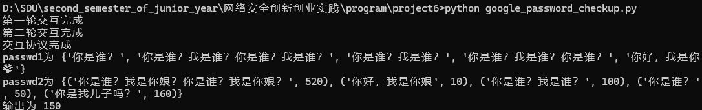

# DDH-based Private Intersection-Sum Protocol 实验报告

## 1. 算法原理

### 1.1 协议概述
本协议实现了基于DDH（Decisional Diffie-Hellman）假设的私有交集求和协议。该协议允许两方在不泄露各自私有数据的情况下，计算其标识符集合交集对应的数值总和。

### 1.2 核心思想
- **私有集合求交**：使用DDH难题的困难性，通过双方分别对哈希值进行指数运算来隐藏原始数据
- **同态加密**：使用Paillier同态加密系统对数值进行加密，支持密文域的加法运算
- **随机化处理**：通过随机排序防止通过位置信息推断数据关联

### 1.3 协议流程

#### 初始化阶段
- 双方约定质数阶群 $G$ 和哈希函数 $H: U \rightarrow G$
- 每方选择随机私有指数 $k_1, k_2$
- P2生成Paillier加密密钥对 $(pk, sk)$

#### Round 1 (P1 → P2)
P1对其集合 $V = \{v_i\}$ 中的每个元素：
1. 计算 $H(v_i)^{k_1}$
2. 随机排序后发送给P2

#### Round 2 (P2 → P1)
P2执行两个操作：
1. 对收到的每个 $H(v_i)^{k_1}$ 计算 $H(v_i)^{k_1 k_2}$，组成集合 $Z$ 发送给P1
2. 对自己的集合 $W = \{(w_j, t_j)\}$，计算 $(H(w_j)^{k_2}, \text{AEnc}(t_j))$ 发送给P1

#### Round 3 (P1 → P2)
P1执行交集计算：
1. 对收到的每个 $(H(w_j)^{k_2}, \text{AEnc}(t_j))$ 计算 $H(w_j)^{k_1 k_2}$
2. 检查 $H(w_j)^{k_1 k_2} \in Z$，确定交集
3. 对交集中的加密值进行同态加法：$\text{AEnc}\left(\sum_{j \in J} t_j\right)$
4. 发送结果给P2

#### 输出阶段
P2解密收到的密文，得到交集对应数值的总和。

#### 流程图示意

```
Party P1:                                      Party P2:

Input:                                         Input:
  V = {v₁, ..., vₘ₁}                             W = {(w₁, t₁), ..., (wₘ₂, tₘ₂)}
  Private key: k₁                               Private key: k₂
                                               (pk, sk) ← AGen(λ)
                                               Send pk to P1

  Step 1: For each vi ∈ V
    Compute H(vi)^k₁
    Shuffle {H(vi)^k₁}
          |
          |------------------------------------>
                                              Step 1: For each received H(vi)^k₁
                                                Compute H(vi)^(k₁k₂)
                                              Step 2:
                                                Form Z = {H(vi)^(k₁k₂)}
          <------------------------------------|
          |
                                              Step 3: For each (wj, tj) ∈ W
                                                Compute H(wj)^k₂
                                                Encrypt tj → Enc(tj)
                                                hash-list = {(H(wj)^k₂, Enc(tj))}
          |
          |------------------------------------>

  Step 2: For each (H(wj)^k₂, Enc(tj)) in hash-list
    Compute H(wj)^(k₁k₂)
    Check if H(wj)^(k₁k₂) ∈ Z
    Let J = indices j such that match found

  Step 3: Homomorphically sum Enc(tj) for j ∈ J
    E(tᵢ + t'₃ + t'₅) = encrypted intersection sum
          |
          |------------------------------------>
                                              Output:
                                                Encrypted intersection sum:
                                                E(tᵢ + t'₃ + t'₅)
```

### 1.4 安全性分析
- **DDH假设**：攻击者无法从 $H(x)^{k_1}$ 和 $H(x)^{k_2}$ 推断出 $H(x)^{k_1 k_2}$
- **语义安全**：Paillier加密保证数值的语义安全
- **随机化**：防止通过顺序推断数据关联

## 2. 代码实现特点

### 2.1 优化方案

#### 2.1.1 高效模幂运算
```python
def exp_mod(self, x, e):
    r = 1
    while e > 0:
        if e & 1 == 1:
            r = (r * x) % self.p
        x = (x * x) % self.p
        e >>= 1
    return r
```
采用二进制快速幂算法，时间复杂度从 $O(e)$ 降低到 $O(\log e)$。

#### 2.1.2 安全随机数生成
```python
def generate_private_key(self):
    while True:
        k = secrets.randbelow(self.p-1) + 1
        if k < self.p-1:
            return k
```
使用`secrets`模块生成密码学安全的随机数，确保私钥的不可预测性。

#### 2.1.3 哈希函数优化
```python
def hash_password(self, password):
    sha256_hex = hashlib.sha256(password.encode()).hexdigest()
    return int(sha256_hex, 16) % self.p
```
使用SHA-256哈希函数，并通过模运算映射到有限域。

#### 2.1.4 同态加密集成
使用`phe`库的Paillier同态加密系统，支持密文域的加法运算：
```python
sum += pair[1]  # 密文的同态加法
```

### 2.2 代码结构

- **Func类**：基础功能类，提供素数生成、模幂运算、哈希等基础功能
- **P1类**：参与方1的实现，负责发起协议和计算交集
- **P2类**：参与方2的实现，负责加密数值和最终解密

### 2.3 测试数据
代码使用中文字符串作为测试数据，验证协议对Unicode字符的支持。

---

# README

## 项目简介

这是一个基于DDH假设的私有交集求和协议的Python实现。该协议允许两方在保护各自隐私的前提下，计算其标识符集合交集对应数值的总和。

## 功能特性

-  基于DDH假设的安全多方计算
-  支持私有集合求交
-  同态加密保护数值隐私
-  抗流量分析的随机化处理
-  密码学安全的随机数生成

## 依赖库

```bash
pip install sympy pycryptodome phe
```

## 核心接口

### Func 基础类

```python
class Func:
    @classmethod
    def setup(cls, bits=1024)  # 初始化大素数
    
    def exp_mod(self, x, e)  # 模幂运算
    def generate_private_key(self)  # 生成私钥
    def hash_password(self, password)  # 哈希函数
    def hash_passwords(self, passwords)  # 批量哈希
```

### P1 参与方1

```python
class P1(Func):
    def __init__(self, password=set)  # 初始化，输入为字符串集合
    def round1(self)  # 第一轮：发送H(vi)^k1
    def round2(self, Z, hash_list)  # 第二轮：接收P2数据
    def round3(self)  # 第三轮：计算交集和，返回加密结果
```

### P2 参与方2

```python
class P2(Func):
    def __init__(self, password=set)  # 初始化，输入为(字符串,数值)对集合
    def round1(self, hash_list)  # 第一轮：接收P1数据
    def round2(self)  # 第二轮：发送Z和加密数据对
    def round3(self, sum)  # 第三轮：解密得到最终结果
```

## 使用示例

### 完整测试代码

```python
def test_protocol():
    Func.setup()
    p1 = P1()
    p2 = P2()
    
    # 三轮交互
    hash_list = p1.round1()
    p2.round1(hash_list)
    print("第一轮交互完成")
    
    Z, hash_list = p2.round2()
    p1.round2(Z, hash_list)
    print("第二轮交互完成")
    
    sum_encrypted = p1.round3()
    result = p2.round3(sum_encrypted)
    print("交互协议完成")
    
    return p1.password, p2.password, result

# 运行测试
passwd1, passwd2, output = test_protocol()
print(f"P1密码集合: {passwd1}")
print(f"P2密码集合: {passwd2}")
print(f"交集数值总和: {output}")
```

## 参数说明

- `bits`: 大素数的位数，默认1024位，影响安全性
- `password`: 输入数据集合
  - P1: 字符串集合
  - P2: (字符串, 数值)对的集合

## 安全考虑

1. **素数生成**: 使用1024位大素数，保证DDH假设的困难性
2. **随机数**: 使用`secrets`模块生成密码学安全随机数
3. **哈希函数**: 使用SHA-256进行哈希运算
4. **同态加密**: 使用Paillier加密系统保护数值隐私
5. **随机化**: 所有发送数据都进行随机排序

## 性能特点

- 时间复杂度: $O(m_1 + m_2)$，其中 $m_1$ 和 $m_2$ 分别是两方的数据量
- 通信复杂度: $O(m_1 + m_2)$
- 适用场景: 中等规模的私有数据求交场景

## 注意事项

1. 协议需要可信的通信信道
2. 大素数位数越高安全性越好，但计算开销也越大
3. 建议在生产环境中使用更长的密钥长度
4. 测试数据包含中文字符，验证Unicode支持

## 测试结果

可以看到，两个password的交集为'你是谁？'和'你是谁？我是谁？'，分别对应value为50和100，交集为150